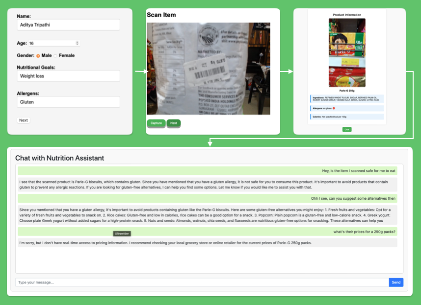

<!-- README.md -->

<h1 align="center" style="color: #4CAF50;">BENi AI Nutritional Tracker App</h1>

<p align="center" style="font-size: 1.2em;">An innovative app to scan food items, track nutritional information, expiry dates, and check for allergens. Chat with AI to get personalized dietary advice!</p>

<div align="center">
    
</div>

---


<h2 style="color: #f39c12;">Tech Stack</h2>
<ul style="font-size: 1.1em;">
    <li><strong>Python</strong> - Backend logic and AI integration</li>
    <li><strong>Flask</strong> - Web framework</li>
    <li><strong>OpenCV</strong> - Image processing and barcode scanning</li>
    <li><strong>pyzbar</strong> - Barcode decoding</li>
    <li><strong>OpenAI API</strong> - AI chat integration</li>
</ul>

---

<h2 style="color: #f39c12;">How to Run</h2>

1. **Clone the repository:**

    ```sh
    git clone https://github.com/yourusername/nutrition-tracker-app.git
    ```

2. **Navigate to the project directory:**

    ```sh
    cd nutrition-tracker-app
    ```

3. **Create and activate a virtual environment:**

    ```sh
    python3 -m venv venv
    source venv/bin/activate  # For Windows use `venv\Scripts\activate`
    ```

4. **Install the required libraries:**

    ```sh
    pip install -r requirements.txt
    ```

5. **Create a `.env` file in the project root and add your API keys:**

    ```sh
    touch .env
    ```

6. **Add the following to your `.env` file:**

    ```sh
    OPENAI_API_KEY=your_openai_api_key
    ```

7. **Run the application:**

    ```sh
    python app.py
    ```

8. **Open your web browser and navigate to:**

    ```sh
    http://localhost:5000
    ```

---

<h2 style="color: #f39c12;">Usage</h2>

<ul style="font-size: 1.1em;">
    <li>Enter your personal dietary information, including allergens and nutritional preferences.</li>
    <li>Scan the barcode of a food item using your phone's camera.</li>
    <li>View detailed nutritional information, expiry dates, and allergens in a well-organized format.</li>
    <li>Chat with the AI to get personalized dietary advice based on the scanned data.</li>
</ul>

---

<h2 style="color: #f39c12;">Features</h2>

<ul style="font-size: 1.1em;">
    <li>Scan barcodes to fetch detailed nutritional information, expiry dates, and allergens.</li>
    <li>Track your dietary intake and manage your nutritional goals.</li>
    <li>Chat with AI to get personalized dietary advice based on scanned data.</li>
</ul>

---

<h2 style="color: #f39c12;">Need for the Idea</h2>
<p style="font-size: 1.1em;">In today's fast-paced world, managing one's diet and ensuring food safety can be challenging. The Nutrition Tracker App aims to simplify this by providing an easy way to scan food items, instantly access vital information, and get personalized advice, ensuring a healthier lifestyle without the constant need for professional consultations.</p>


<h2 style="color: #f39c12;">Contributions</h2>
<p style="font-size: 1.1em;">We welcome contributions from the community to make this project better! Feel free to fork the repository, make your changes, and submit a pull request. Please ensure your contributions align with the project's goals and adhere to our coding standards.</p>

<p style="font-size: 1.1em;">Here's how you can contribute:</p>
<ul style="font-size: 1.1em;">
    <li>Fork the repository: <a href="https://github.com/BENi-Aditya/BENi-AI-Nutritional-Tracker">https://github.com/BENi-Aditya/BENi-AI-Nutritional-Tracker</a></li>
    <li>Create a new branch: <code>git checkout -b feature-branch-name</code></li>
    <li>Make your changes and commit them: <code>git commit -m 'Description of your changes'</code></li>
    <li>Push to the branch: <code>git push origin feature-branch-name</code></li>
    <li>Submit a pull request</li>
</ul>


